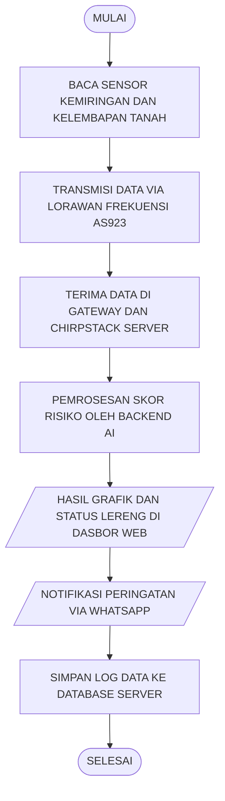

<div align="center">
  <h1>🏔️ SLOPEX (Slope Expert)</h1>
  <p><b>Sistem Pemantauan dan Peringatan Dini Longsor Berbasis IoT LoRaWAN dan Kecerdasan Buatan</b></p>
  <p><i>Program Kreativitas Mahasiswa - Karsa Cipta (PKM-KC) 2026 | Universitas Padjadjaran</i></p>
</div>

---

## 📖 Deskripsi Proyek
**SLOPEX** adalah purwarupa instrumen *Early Warning System* (EWS) tanah longsor terintegrasi yang dirancang untuk mengatasi tantangan pemantauan di area *blank spot* seluler. Instrumen ini menggabungkan pembacaan sensor kelembapan tanah (*Soil Moisture*) dan kemiringan (ADXL345) yang diproses menggunakan mikrokontroler ESP32. 

Inovasi utama SLOPEX terletak pada penggunaan protokol komunikasi **LoRaWAN (Frekuensi AS923)** yang hemat daya untuk mengirimkan data ke *Gateway* dan **ChirpStack Network Server**. Di sisi *backend*, data dianalisis menggunakan **Kecerdasan Buatan (AI - Random Forest)** untuk menghasilkan klasifikasi risiko longsor dan memberikan peringatan dini (*sirine*, aktuasi pompa drainase, dan notifikasi WhatsApp) secara *real-time*.

## 🏗️ Arsitektur Sistem



## 📂 Struktur Repositori
Repositori ini disusun sebagai bentuk transparansi data dan portofolio teknis pengembangan (Open-Source).

```text
📦 SLOPEX-IoT
 ┣ 📂 data         # Dataset kalibrasi (format .csv) untuk uji RMSE dan akurasi sensor
 ┣ 📂 src          # Source code mikrokontroler (C++/Arduino) dan pengkondisian sinyal LoRa
 ┣ 📂 hardware     # Skematik kelistrikan, wiring diagram, dan desain PCB (KiCad)
 ┣ 📂 docs         # Dokumentasi tangkapan layar dasbor ChirpStack dan aset visual laporan
 ┗ 📜 README.md    # Halaman informasi utama proyek
```

## 🛠️ Spesifikasi Teknologi (*Tech Stack*)
* **Perangkat Keras (Hardware):** ESP32, Sensor Soil Moisture, Sensor Kemiringan ADXL345, Modul LoRa Node.
* **Komunikasi & Jaringan:** LoRaWAN (AS923 MHz), ChirpStack LNS.
* **Perangkat Lunak (Software):** C++ (Arduino IDE), Python (Data Analisis & Machine Learning).

## 📊 Dataset dan Kalibrasi Validasi
Kami sangat menjunjung tinggi integritas data dalam riset ini. Seluruh data mentah hasil uji kalibrasi instrumen SLOPEX terhadap alat standar (seperti pengukur VWC HOBOware) dapat ditinjau dan diunduh di dalam folder [`/data`](./data). Format data disediakan dalam bentuk **`.csv`** agar dapat dengan mudah direproduksi menggunakan skrip Python/R untuk validasi nilai *Root Mean Square Error* (RMSE) dan akurasi rata-rata yang kami cantumkan pada laporan akhir.

## 👥 Tim Pengembang
Proyek ini dikembangkan oleh Tim PKM-KC Universitas Padjadjaran (Tim Aetherion/SLOPEX):
* **Dhafa Rizi** (Manajemen Perangkat Keras & IoT)
* **Jihan Fauziah** 
* **Vina Selvia**
* **Josephine Sagala**
* **M. Irsyad Azharil Haq**

## 📄 Lisensi
Sistem ini dirilis di bawah naungan **MIT License**. Kami sangat mendukung replikasi dan pengembangan instrumen pemantau kebencanaan oleh civitas akademika, peneliti, maupun instansi penanggulangan bencana demi kemanusiaan.
